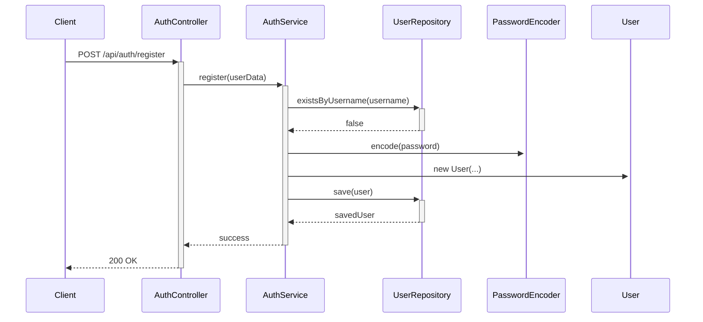
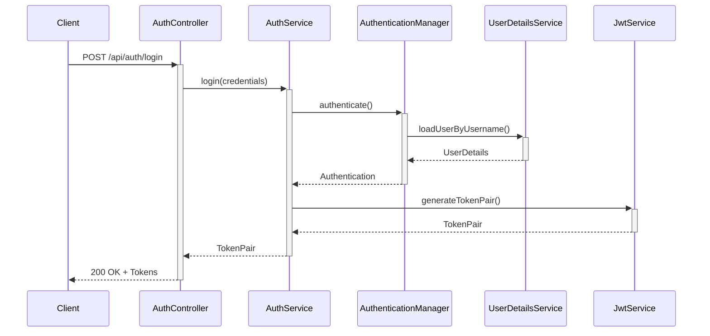
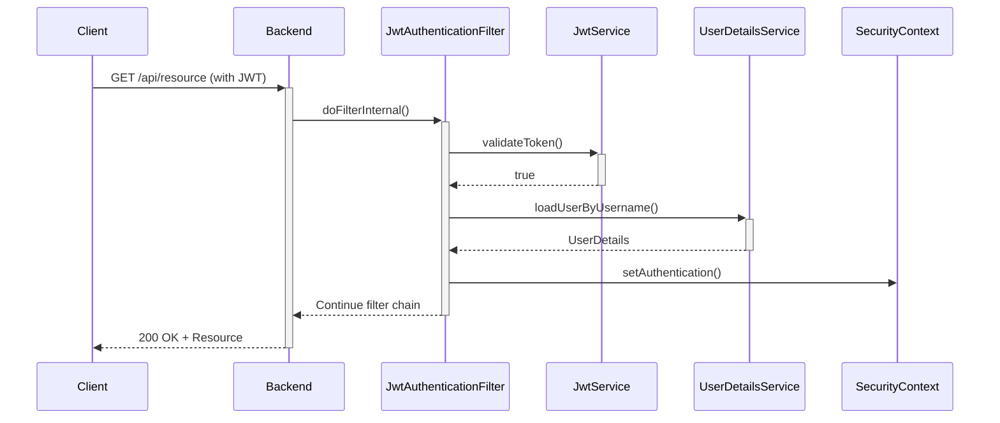

# Application Architecture: Spring Boot Security with JWT

## Table of Contents
1. [System Overview](#system-overview)
2. [Architecture Diagram](#architecture-diagram)
3. [Core Components](#core-components)
4. [Authentication Flow](#authentication-flow)
5. [Authorization Process](#authorization-process)
6. [Security Implementation](#security-implementation)
7. [Data Flow](#data-flow)
8. [Error Handling](#error-handling)
9. [Scalability Considerations](#scalability-considerations)
10. [Security Considerations](#security-considerations)

## System Overview

This application is a secure RESTful API built with Spring Boot 3.5.0 and Spring Security 6, implementing JWT (JSON Web Token) based authentication. The system provides user registration, authentication, and role-based access control to protected resources.

## Architecture Diagram

```
+------------------+       +------------------+       +------------------+
|                  |       |                  |       |                  |
|    Client App    |<----->|   Spring Boot    |<----->|   MySQL Database |
|  (Browser/Postman)|       |     Backend     |       |                  |
|                  |       |                  |       |                  |
+------------------+       +------------------+       +------------------+
                                    ^
                                    |
                                    v
                            +------------------+
                            |                  |
                            |   JWT Validation  |
                            |   & Generation   |
                            |                  |
                            +------------------+
```

## Core Components

### 1. Security Configuration (`SecurityConfig`)
- Configures Spring Security settings
- Defines public and protected endpoints
- Sets up authentication manager and password encoder
- Configures CORS and CSRF settings
- Integrates JWT filter into the security filter chain

### 2. JWT Service (`JwtService`)
- Handles JWT token creation, validation, and parsing
- Manages both access and refresh tokens
- Implements token expiration and validation logic
- Handles token signing and verification

### 3. Authentication Service (`AuthService`)
- Manages user registration and authentication
- Handles password encoding and validation
- Coordinates with JWT service for token generation
- Manages user sessions and authentication state

### 4. User Management (`User`, `UserDetailsService`)
- `User` entity representing application users
- Implements Spring Security's `UserDetails`
- Manages user roles and authorities
- Handles user data persistence

### 5. Controllers (`AuthController`)
- Exposes REST endpoints for authentication
- Handles HTTP requests and responses
- Manages request/response DTOs
- Applies input validation

## Authentication Flow

### 1. User Registration


### 2. User Login


### 3. Accessing Protected Resources


## Authorization Process

1. **Role-Based Access Control (RBAC)**
   - Users are assigned roles (e.g., ROLE_USER, ROLE_ADMIN)
   - Endpoints are secured using method-level security annotations
   - Example: `@PreAuthorize("hasRole('ADMIN')")`

2. **Method Security**
   - `@EnableMethodSecurity` enables method-level security
   - Fine-grained permission control on service methods
   - Expression-based access control

3. **Token-Based Authorization**
   - JWT contains user roles and permissions
   - Tokens are stateless and self-contained
   - No server-side session storage required

## Security Implementation

### 1. JWT Implementation
- **Access Token**: Short-lived (15 minutes)
- **Refresh Token**: Longer-lived (7 days)
- **Signing Algorithm**: HMAC-SHA512
- **Claims**: Username, roles, token type, expiration

### 2. Password Security
- BCrypt password hashing
- Configurable strength (default: 10)
- Automatic salt generation

### 3. HTTPS/SSL
- Recommended for production
- Prevents man-in-the-middle attacks
- Ensures data confidentiality

## Data Flow

1. **Request Flow**:
   - Client sends HTTP request
   - JWT filter validates token
   - Security context is populated
   - Controller processes request
   - Service layer handles business logic
   - Repository interacts with database

2. **Response Flow**:
   - Data is returned from repository
   - Service layer processes data
   - Controller formats response
   - Response is sent to client

## Error Handling

### 1. Authentication Errors
- Invalid credentials
- Expired tokens
- Malformed tokens
- Disabled/locked accounts

### 2. Authorization Errors
- Insufficient permissions
- Missing authentication
- Invalid token signature

### 3. Validation Errors
- Invalid input data
- Missing required fields
- Constraint violations

## Scalability Considerations

1. **Stateless Architecture**
   - No server-side session storage
   - Easy horizontal scaling
   - Load balancing friendly

2. **Database Optimization**
   - Indexed user fields
   - Efficient queries
   - Connection pooling

3. **Caching**
   - Token blacklisting
   - User details caching
   - Response caching for public endpoints

## Security Considerations

1. **Token Security**
   - Secure token storage (HTTP-only cookies)
   - Short-lived access tokens
   - Secure token transmission (HTTPS only)

2. **Input Validation**
   - Server-side validation
   - Protection against XSS and SQL injection
   - Request size limits

3. **Monitoring & Logging**
   - Audit logging
   - Failed login attempts
   - Suspicious activities

4. **Rate Limiting**
   - Protection against brute force
   - API request throttling
   - IP-based rate limiting

## Performance Considerations

1. **Token Validation**
   - Asymmetric signing for reduced server load
   - Efficient claim parsing
   - Minimal database lookups

2. **Database**
   - Optimized queries
   - Proper indexing
   - Connection pooling

3. **Response Times**
   - Minimal payload size
   - Efficient serialization
   - Compression where applicable
